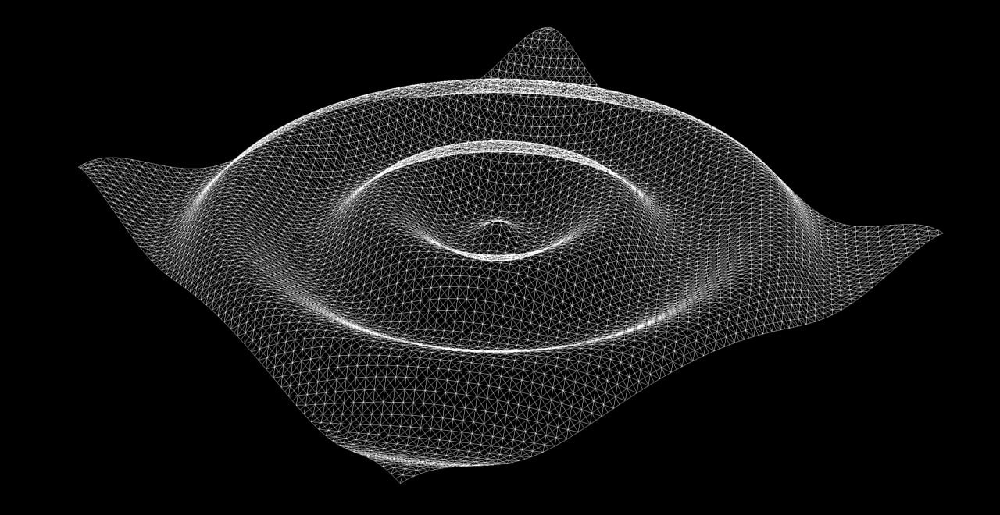

# Graphics Exploration

Это репозиторий, в котором я осваивал основы компьютерной графики с использованием OpenGL на языке C++ (и линейную алгебру подтягивал).

## Зачем?
Мне хотелось разобраться, как устроена низкоуровневая компьютерная графика. Возможно, в жизни каждого программиста наступает момент, когда появляется жгучее желание создать свою видеоигру. А гораздо интереснее (и болезненнее!) делать это, начав с написания собственного движка. Хоть в ходе изучения компьютерной графики я понял, что gamedev - не моё, но этот мини-проект окончательно определил мой интерес в сторону максимально низкоуровневых систем!

## Ресурсы
В этом нелегком деле мне очень помогли разобраться:
*  курс по основам компьютерной графики от Joey de Vries - [LearnOpenGL](https://learnopengl.com/),
* математические [заметки](https://www.songho.ca/opengl/) Song Ho Ahn.

## Отрабатываемые навыки: 
* базовое ООП на С++;
* базовый язык шейдеров GLSL;
* управление памятью: оперирование буферами VBO, VAO для передачи данных между оперативной памяти ни памяти GPU;
* матричные преобразование.

## Результат

